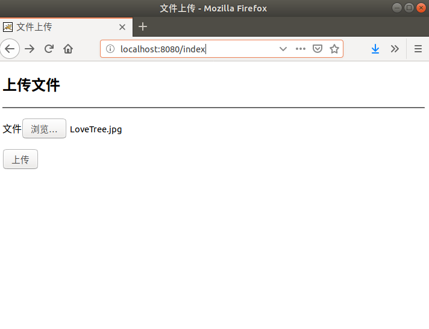
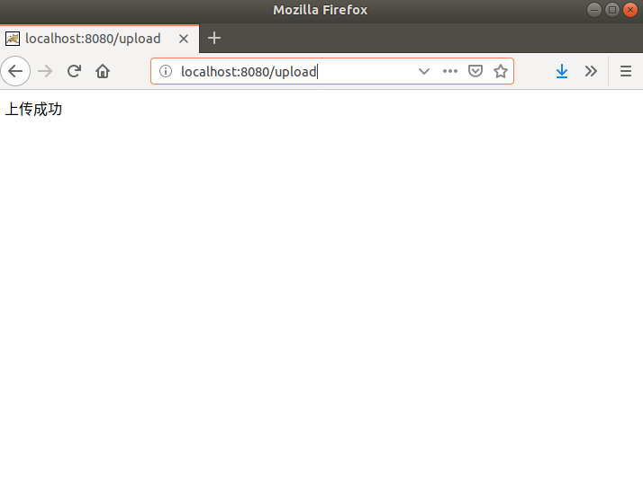
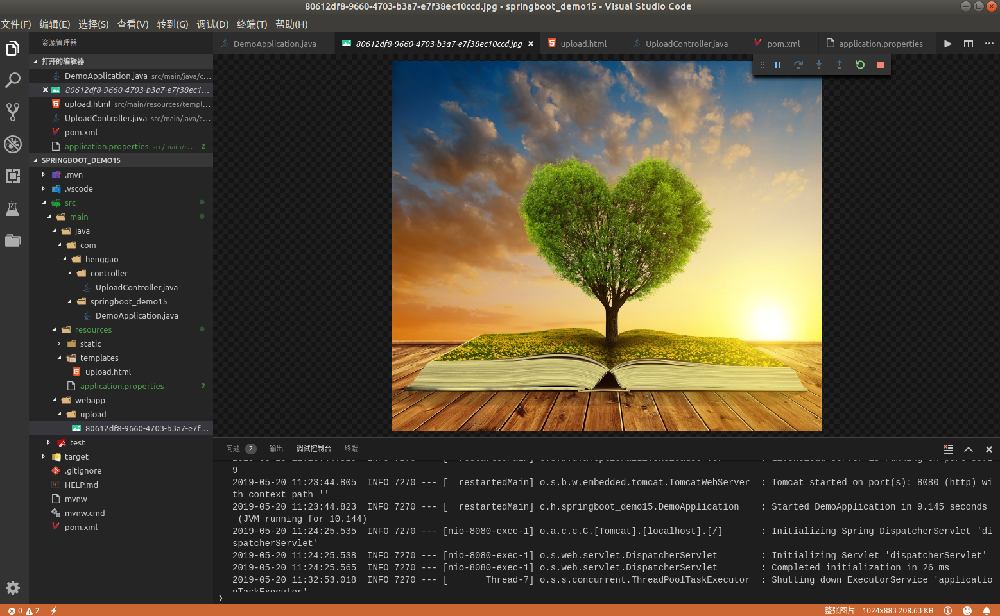

## Demo22：SpringBoot实现文件上传

1）、配置pom.xml

```xml
<?xml version="1.0" encoding="UTF-8"?>
<project xmlns="http://maven.apache.org/POM/4.0.0" xmlns:xsi="http://www.w3.org/2001/XMLSchema-instance"
	xsi:schemaLocation="http://maven.apache.org/POM/4.0.0 http://maven.apache.org/xsd/maven-4.0.0.xsd">
	<modelVersion>4.0.0</modelVersion>
	<parent>
		<groupId>org.springframework.boot</groupId>
		<artifactId>spring-boot-starter-parent</artifactId>
		<version>2.1.5.RELEASE</version>
		<relativePath/> <!-- lookup parent from repository -->
	</parent>
	<groupId>com.henggao</groupId>
	<artifactId>springboot_demo15</artifactId>
	<version>0.0.1-SNAPSHOT</version>
	<name>demo</name>
	<description>Demo project for Spring Boot</description>

	<properties>
		<java.version>1.8</java.version>
	</properties>

	<dependencies>
		<dependency>
			<groupId>org.springframework.boot</groupId>
			<artifactId>spring-boot-starter-thymeleaf</artifactId>
		</dependency>
		<dependency>
			<groupId>org.springframework.boot</groupId>
			<artifactId>spring-boot-starter-web</artifactId>
		</dependency>

		<dependency>
			<groupId>org.springframework.boot</groupId>
			<artifactId>spring-boot-devtools</artifactId>
			<scope>runtime</scope>
		</dependency>
		<dependency>
			<groupId>org.projectlombok</groupId>
			<artifactId>lombok</artifactId>
			<optional>true</optional>
		</dependency>
		<dependency>
			<groupId>org.springframework.boot</groupId>
			<artifactId>spring-boot-starter-test</artifactId>
			<scope>test</scope>
		</dependency>
	</dependencies>

	<build>
		<plugins>
			<plugin>
				<groupId>org.springframework.boot</groupId>
				<artifactId>spring-boot-maven-plugin</artifactId>
			</plugin>
		</plugins>
	</build>

</project>

```

2）、编写applicati.propert

```properties
#设置上传达小
multipart.maxFileSize= 500Mb
multipart.maxRequestSize= 500Mb
```

3）、编写UploadController.java

```java
package com.henggao.controller;

import java.io.File;
import java.util.UUID;

import javax.servlet.http.HttpServletRequest;

import org.springframework.stereotype.Controller;
import org.springframework.web.bind.annotation.RequestMapping;
import org.springframework.web.bind.annotation.RequestMethod;
import org.springframework.web.bind.annotation.ResponseBody;
import org.springframework.web.multipart.MultipartFile;

/**
 * UploadController
 */
@Controller
public class UploadController {

    @RequestMapping("/index")
    public String toUpload() {

        return "upload";
    }

    @RequestMapping(value = "/upload", method = RequestMethod.POST)
    @ResponseBody
    public String uploadFile(MultipartFile file, HttpServletRequest request) {

        try {

            // 创建文件在服务器端的存放路径
            String dir = request.getServletContext().getRealPath("/upload");
            File fileDir = new File(dir);
            if (!fileDir.exists()) {
                fileDir.mkdirs();
                // 生成文件在服务器存放的名字
                String filesSuffix = file.getOriginalFilename().substring(file.getOriginalFilename().lastIndexOf("."));
                String fileName = UUID.randomUUID().toString() + filesSuffix;
                File files = new File(fileDir + "/" + fileName);
                // 上传
                file.transferTo(files);
            }
        } catch (Exception e) {
            e.printStackTrace();
            return "上传失败";
        }
        return "上传成功";
    }
}
```

4）、启动类DemoApplication.java

```java
package com.henggao.springboot_demo15;

import org.springframework.boot.SpringApplication;
import org.springframework.boot.autoconfigure.SpringBootApplication;

@SpringBootApplication(scanBasePackages = "com.henggao")
public class DemoApplication {

	public static void main(String[] args) {
		SpringApplication.run(DemoApplication.class, args);
	}

}

```

5）、在Main文件夹下新建webapp文件夹

6）、运行Debug、浏览器查看http://localhost:8080/index





