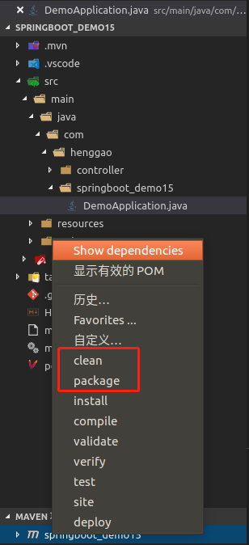
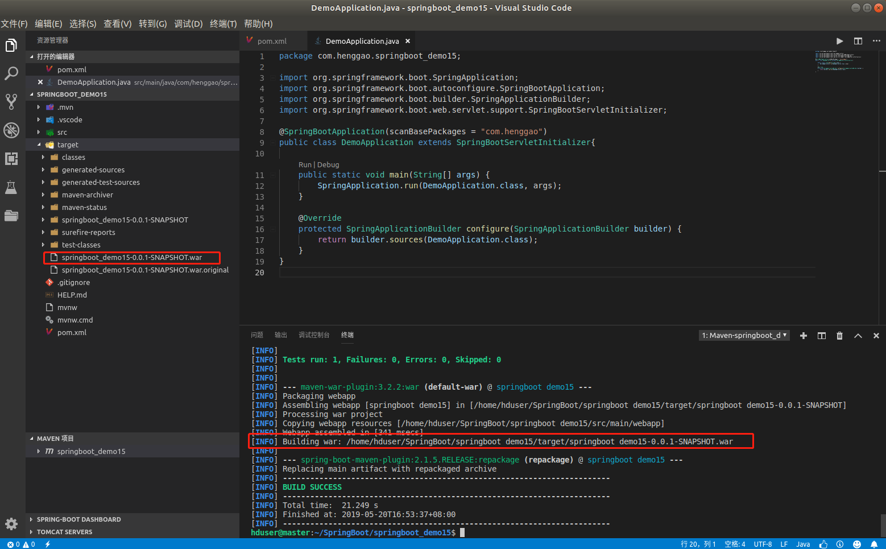

## Demo23:SpringBoot打包发布

1）、pom.xml 文件 首先更改打包方式 war,再排除springboot内置的 web 项目下tomcat依赖。

```xml
<dependency>
		<groupId>org.springframework.boot</groupId>
		<artifactId>spring-boot-starter-web</artifactId>
		<exclusions>
			<exclusion>
				<groupId>org.springframework.boot</groupId>
				<artifactId>spring-boot-starter-tomcat</artifactId>
			</exclusion>
		</exclusions>
</dependency>
```

2）、引入tomcat依赖.

```xml
<dependency>
    <groupId>org.springframework.boot</groupId>
    <artifactId>spring-boot-starter-tomcat</artifactId>
    <scope>provided</scope>
</dependency>
```

3）、修改启动类

```java
package com.henggao.springboot_demo15;

import org.springframework.boot.SpringApplication;
import org.springframework.boot.autoconfigure.SpringBootApplication;
import org.springframework.boot.builder.SpringApplicationBuilder;
import org.springframework.boot.web.servlet.support.SpringBootServletInitializer;

@SpringBootApplication(scanBasePackages = "com.henggao")
public class DemoApplication extends SpringBootServletInitializer{

	public static void main(String[] args) {
		SpringApplication.run(DemoApplication.class, args);
	}

    @Override
    protected SpringApplicationBuilder configure(SpringApplicationBuilder builder) {
        return builder.sources(DemoApplication.class);
    }
}

```

4）、maven项目运行clean、package。



5）、查看




