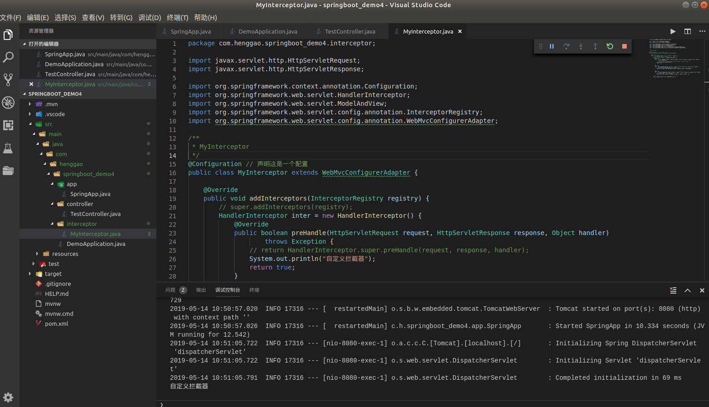

## Demo7：FastJson解析JSON

### 1）、pom.xml添加配置

```xml
<!-- fastjson的依赖 -->
<dependency>
    <groupId>com.alibaba</groupId>
    <artifactId>fastjson</artifactId>
    <version>1.2.15</version>
</dependency>
```

### 2）、第一种让启动类继承**WebMvcfigureAdapter**（已弃用）。

#### 	1>、在App文件夹下写SpringApplication.java

```java
package com.henggao.springboot_demo3.app;

import java.util.List;

import com.alibaba.fastjson.serializer.SerializerFeature;
import com.alibaba.fastjson.support.config.FastJsonConfig;
import com.alibaba.fastjson.support.spring.FastJsonHttpMessageConverter;

import org.springframework.boot.SpringApplication;
import org.springframework.boot.autoconfigure.SpringBootApplication;
import org.springframework.http.converter.HttpMessageConverter;
import org.springframework.web.servlet.config.annotation.WebMvcConfigurerAdapter;

/**
 * SpringApplications
 */
@SpringBootApplication(scanBasePackages = "com.henggao.springboot_demo3.controller")

public class SpringApplications extends WebMvcConfigurerAdapter {

    @Override
    public void configureMessageConverters(List<HttpMessageConverter<?>> converters) {
        // 创建Fastjson转换器
        FastJsonHttpMessageConverter convert = new FastJsonHttpMessageConverter();
        // 创建Fastson的配置对象
        FastJsonConfig config = new FastJsonConfig();
        // Json数据进行格式化
        config.setSerializerFeatures(SerializerFeature.PrettyFormat);

        convert.setFastJsonConfig(config);
        converters.add(convert);
    }

    public static void main(String[] args) {
        SpringApplication.run(SpringApplications.class, args);
    }

}
```

#### 	2>、在controller文件夹下写TestController.java

```java
package com.henggao.springboot_demo3.controller;

import java.util.Date;

import com.henggao.springboot_demo3.pojo.Person;

import org.springframework.stereotype.Controller;
import org.springframework.web.bind.annotation.RequestMapping;
import org.springframework.web.bind.annotation.ResponseBody;

/**
 * TestController2
 */
@Controller
public class TestController {

    @RequestMapping("/person")
    @ResponseBody
    public Object show() {
        Person ren = new Person();
        ren.setId(66);
        ren.setName("恒高");
        ren.setDate(new Date());
        return ren;
    }

}
```

#### 	3>、在pojo文件夹下写一个Person.java

```java
package com.henggao.springboot_demo3.pojo;

import java.util.Date;

import lombok.Data;

/**
 * Person
 */
@Data
public class Person {
    private int id;
    private String name;
    @JSONField(format = "yyyy-MM-DD HH:mm:ss") //格式化时间
    private Date date;

}
```

#### 	4>、运行Debug，在浏览器输入http://localhost:8080/person，成功显示。


### 3）、**@Bean**注入

#### 	1> 、修改App文件夹下写SpringApplication.java

```java
package com.henggao.springboot_demo3.app;

// import java.util.List;

import com.alibaba.fastjson.serializer.SerializerFeature;
import com.alibaba.fastjson.support.config.FastJsonConfig;
import com.alibaba.fastjson.support.spring.FastJsonHttpMessageConverter;

import org.springframework.boot.SpringApplication;
import org.springframework.boot.autoconfigure.SpringBootApplication;
import org.springframework.boot.autoconfigure.http.HttpMessageConverters;
import org.springframework.context.annotation.Bean;
import org.springframework.http.converter.HttpMessageConverter;
// import org.springframework.web.servlet.config.annotation.WebMvcConfigurerAdapter;

/**
 * SpringApplications
 */
@SpringBootApplication(scanBasePackages = "com.henggao.springboot_demo3.controller")

// public class SpringApplications extends WebMvcConfigurerAdapter {

// @Override
// public void configureMessageConverters(List<HttpMessageConverter<?>>
// converters) {
// // 创建Fastjson转换器
// FastJsonHttpMessageConverter convert = new FastJsonHttpMessageConverter();
// // 创建Fastson的配置对象
// FastJsonConfig config = new FastJsonConfig();
// // Json数据进行格式化
// config.setSerializerFeatures(SerializerFeature.PrettyFormat);

// convert.setFastJsonConfig(config);
// converters.add(convert);
// }

public class SpringApplications {

    @Bean
    public HttpMessageConverters fastJsMessageConverter() {
        // 创建Fastjson转换器
        FastJsonHttpMessageConverter convert = new FastJsonHttpMessageConverter();
        // 创建Fastson的配置对象
        FastJsonConfig config = new FastJsonConfig();
        // Json数据进行格式化
        config.setSerializerFeatures(SerializerFeature.PrettyFormat);

        convert.setFastJsonConfig(config);
        HttpMessageConverter<?> con = convert;
        return new HttpMessageConverters(con);

    }

    public static void main(String[] args) {
        SpringApplication.run(SpringApplications.class, args);
    }

}
```

#### 	2>、运行Debug，在浏览器输入http://localhost:8080/person，成功显示。


#### 解决中文乱码问题，

springboot默认配置式UTF-8，需要开启响应配置，在appliaction.properties中添加配置。

```properties
spring.http.encoding.force= true
```

## Demo8：自定义拦截器

1）、在controller文件夹下写一个TestController.java文件

```java
package com.henggao.springboot_demo4.controller;

import org.springframework.stereotype.Controller;
import org.springframework.web.bind.annotation.RequestMapping;
import org.springframework.web.bind.annotation.ResponseBody;

/**
 * TestController
 */
@Controller
public class TestController {

    @RequestMapping("/tt")
    @ResponseBody
    private String tests() {
        return "Hello , 你好 ～";
    }
    
}
```

2）、在app文件夹下写一个SpringApp.java文件

```java
package com.henggao.springboot_demo4.app;

import org.springframework.boot.SpringApplication;
import org.springframework.boot.autoconfigure.SpringBootApplication;

/**
 * SpringApp
 */
@SpringBootApplication(scanBasePackages = {"com.henggao.springboot_demo4.controller","com.henggao.springboot_demo4.interceptor"})
public class SpringApp {
    public static void main(String[] args) {
        SpringApplication.run(SpringApp.class, args);
}
    
}
```

3）、在interceptor文件夹下写一个MyInterceptor.java拦截器文件。

```java
package com.henggao.springboot_demo4.interceptor;

import javax.servlet.http.HttpServletRequest;
import javax.servlet.http.HttpServletResponse;

import org.springframework.context.annotation.Configuration;
import org.springframework.web.servlet.HandlerInterceptor;
import org.springframework.web.servlet.ModelAndView;
import org.springframework.web.servlet.config.annotation.InterceptorRegistry;
import org.springframework.web.servlet.config.annotation.WebMvcConfigurerAdapter;

/**
 * MyInterceptor
 */
@Configuration // 声明这是一个配置
public class MyInterceptor extends WebMvcConfigurerAdapter {

    @Override
    public void addInterceptors(InterceptorRegistry registry) {
        // super.addInterceptors(registry);
        HandlerInterceptor inter = new HandlerInterceptor() {
            @Override
            public boolean preHandle(HttpServletRequest request, HttpServletResponse response, Object handler)
                    throws Exception {
                // return HandlerInterceptor.super.preHandle(request, response, handler);
                System.out.println("自定义拦截器");
                return true;
            }

            @Override
            public void postHandle(HttpServletRequest request, HttpServletResponse response, Object handler,
                    ModelAndView modelAndView) throws Exception {
                HandlerInterceptor.super.postHandle(request, response, handler, modelAndView);
            }

            @Override
            public void afterCompletion(HttpServletRequest request, HttpServletResponse response, Object handler,
                    Exception ex) throws Exception {
                HandlerInterceptor.super.afterCompletion(request, response, handler, ex);
            }
        };
        registry.addInterceptor(inter).addPathPatterns("/**");
    }

}

```

4）、运行Debug，浏览器输入http://localhost:8080/tt

浏览器显示如下


控制台显示如下：



