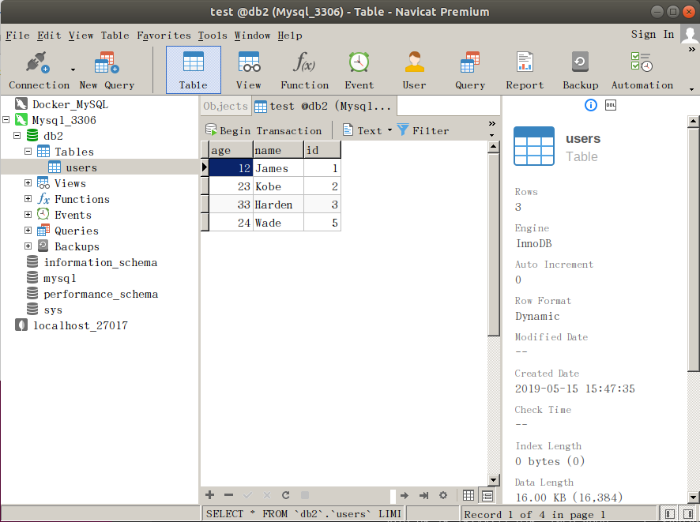

## Demo15：SpringBoot整合JDBC

导入常用相关插件Lombok、web、thymeleaf、jdbc、mysql。

1）、编写User.java

```java
package com.henggao.springboot_demo9.pojo;

import lombok.Data;

/**
 * Users
 */
@Data
public class Users {

    private Integer id;
    private String name;
    private int age;

}
```

2）、编写UserDao.java

```java
package com.henggao.springboot_demo9.dao;

import com.henggao.springboot_demo9.pojo.Users;

import org.springframework.beans.factory.annotation.Autowired;
import org.springframework.jdbc.core.JdbcTemplate;
import org.springframework.stereotype.Repository;

/**
 * UserDao
 */
@Repository
public class UserDao {
    @Autowired
    private JdbcTemplate jdbcTemplate;

    public void addUser(Users user) {
        jdbcTemplate.update("insert into users(id,name,age) values(?,?,?)", new Object[]{user.getId(),user.getName(),user.getAge()});
    }
}
```

3）、编写UserService.java

```java
package com.henggao.springboot_demo9.service;

import com.henggao.springboot_demo9.dao.UserDao;
import com.henggao.springboot_demo9.pojo.Users;

import org.springframework.beans.factory.annotation.Autowired;
import org.springframework.stereotype.Service;

/**
 * UserService
 */
@Service
public class UserService {

    @Autowired
    private UserDao userDao;
    public void saveUser(Users user) {
        userDao.addUser(user);
    }
}
```

4）、编写UserController.java

```java
package com.henggao.springboot_demo9.controller;

import com.henggao.springboot_demo9.pojo.Users;
import com.henggao.springboot_demo9.service.UserService;

import org.springframework.beans.factory.annotation.Autowired;
import org.springframework.stereotype.Controller;
import org.springframework.web.bind.annotation.RequestMapping;
import org.springframework.web.bind.annotation.ResponseBody;

/**
 * UserController
 */
@Controller
public class UserController {
    @Autowired
    private UserService userService;

    @RequestMapping("/saveUser")
    @ResponseBody
    public String save() {
        Users user = new Users();
        user.setId(5);
        user.setName("Wade");
        user.setAge(24);
        userService.saveUser(user);
        return "success";
    }
    
}
```

5）、配置application.propert

```properties
spring.datasource.driverClassName=com.mysql.cj.jdbc.Driver
spring.datasource.username= henggao
spring.datasource.password= abc123
spring.datasource.url=jdbc:mysql://127.0.0.1:3306/db2

server.port=8080
```

6）、链接数据库，运行Debug，浏览器输入，查看

浏览器显示


数据库显示



注意：

配置application.propert有的编译器不识别如下配置，需要改为上面的

```properties
spring.datasource.driver-class-name==com.mysql.cj.jdbc.Driver
spring.datasource.data-username== henggao
spring.datasource.data-password== abc123
spring.datasource.url=jdbc:mysql://127.0.0.1:3306/db2

server.port=8080
```

