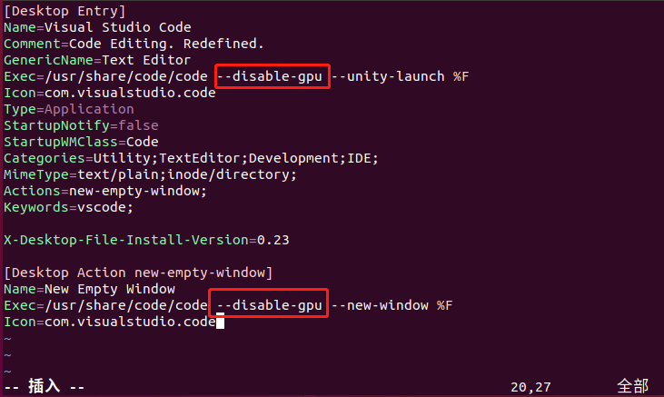

## VSCode优化

网上查了下，说是要禁用 gpu。那怎么设置呢？我自己将 vscode 设置到左边快速启动栏了。所以需要修改配置

```shell
hduser@data1:~$ cd /usr/share/applications
hduser@data1:/usr/share/applications$ sudo vim code.desktop
```

在打开的文件中`两处地方`加入 `--disable-gpu`，如下：

下面是修改添加的部分

